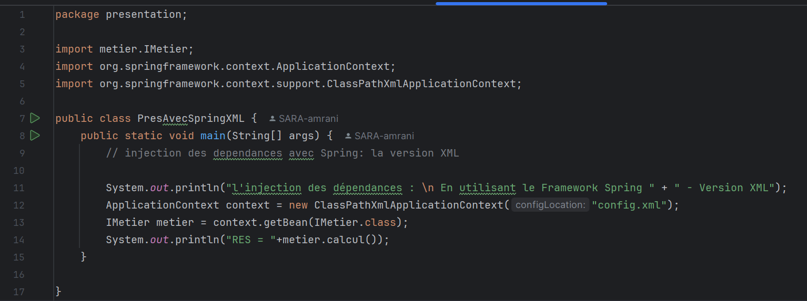

Ce projet illustre les principes d'injection de dépendances et de couplage faible en Java, avec une implémentation simple de deux interfaces (IDao et IMetier) et leurs implémentations.
Introduction

# Activité Pratique N°1 - Injection des dépendances

## INTRODUCTION

L’objectif de ce rapport est de mettre en place un système de gestion basé sur le principe de l’injection de dépendances afin de mieux organiser le code et de réduire le couplage entre les différentes classes. 
Ce concept est essentiel en programmation orientée objet, car il permet de rendre les applications plus flexibles et maintenables.

Dans cette étude, nous allons suivre plusieurs étapes pour implémenter ce principe : la création d’interfaces, l’implémentation de ces interfaces, puis l’injection des dépendances de différentes manières, notamment en utilisant le framework Spring.

## Architecture du projet

Le projet est structuré en plusieurs packages afin de séparer clairement les différentes responsabilités :

- dao : Contient l’interface IDao et ses implémentations (DaoImpl, DaoImplV2).

- metier : Contient l’interface IMetier et son implémentation MetierImpl.

- presentation : Contient les différentes classes de test et d’exécution (PresStatique, PresDynamique, PresAvecSpringXML, PresSpringAnnotation).

- resources : Contient le fichier config.xml pour la configuration de Spring en XML.

Cette architecture permet une séparation claire des couches et facilite l’injection des dépendances:

## Partie 1 : Implémentation des interfaces et des classes

1. **Création de l’interface IDao avec une méthode getData**
    - Cette interface définit une méthode `getData()` qui sera implémentée par une classe spécifique.

2. **Création d’une implémentation de l’interface IDao**
    - Une classe `DaoImpl` implémente l’interface IDao en retournant des données spécifiques.

3. **Création de l’interface IMetier avec une méthode calcul**
    - Cette interface définit une méthode `calcul()` qui utilisera les données fournies par IDao.

4. **Création d’une implémentation de IMetier en utilisant le couplage faible**
    - Une classe `MetierImpl` implémente IMetier et utilise IDao en favorisant le couplage faible via un setter ou un constructeur.

## Partie 2 : Injection des dépendances

1. **Injection par instanciation statique**
    - Ici, nous effectuons une instanciation manuelle des objets dans la méthode principale.

   ### résultat de l'exécution

2. **Injection par instanciation dynamique**
    - L’injection est réalisée en utilisant le mécanisme de réflexion pour charger dynamiquement les classes.

    

      ### résultat de l'exécution

    

3. **Injection en utilisant le framework Spring**

   a. **Version XML**
    - Configuration des beans dans un fichier XML.

    => Fichier XML de configuration Spring
   
    => Code pour cette version
   

   ### résultat de l'exécution

   

   b. **Version annotations**
    - Utilisation des annotations `@Component`, `@Autowired`, et `@Service`.

   

      ### résultat de l'exécution

   

## CONCLUSION

L’injection de dépendances est une technique essentielle pour améliorer la modularité et la flexibilité des applications. Nous avons exploré plusieurs méthodes pour injecter des dépendances, en passant par l’instanciation statique, dynamique et l’utilisation du framework Spring.

L’approche utilisant Spring est particulièrement efficace, car elle permet de gérer les dépendances de manière automatique, réduisant ainsi la complexité du code et facilitant la maintenance. En adoptant ces pratiques, nous nous assurons d’avoir un code plus propre, maintenable et évolutif.

